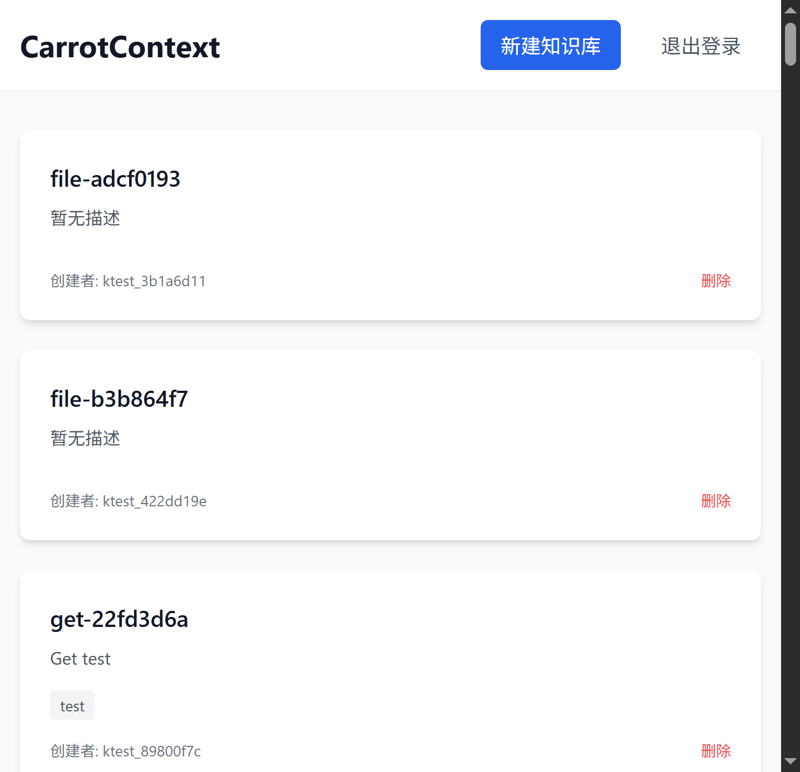
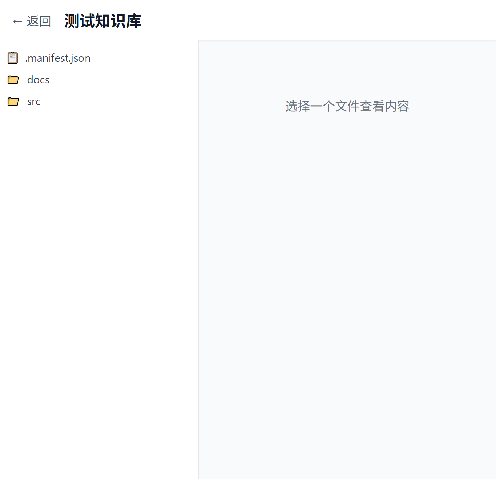
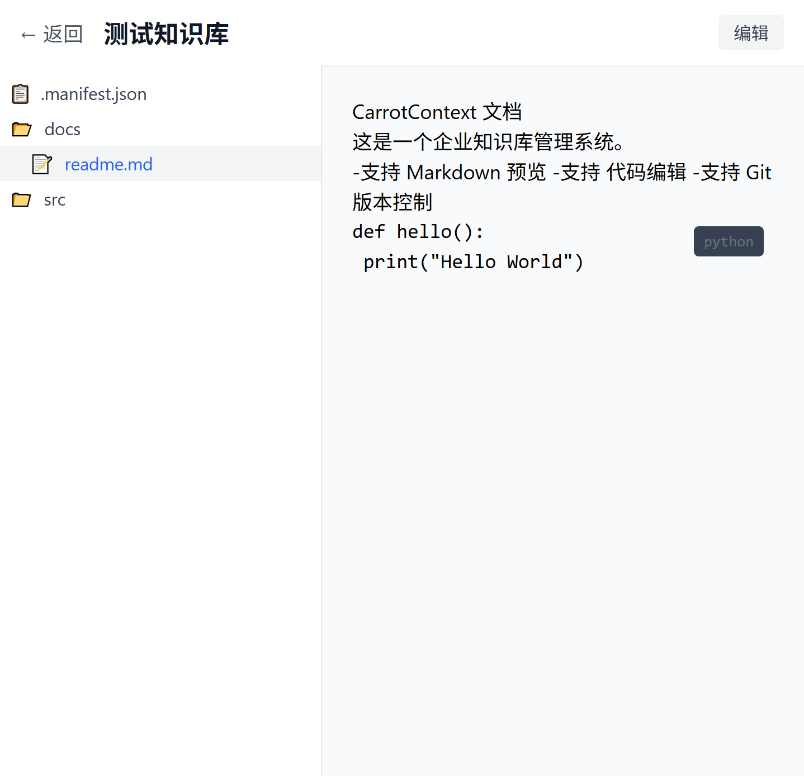
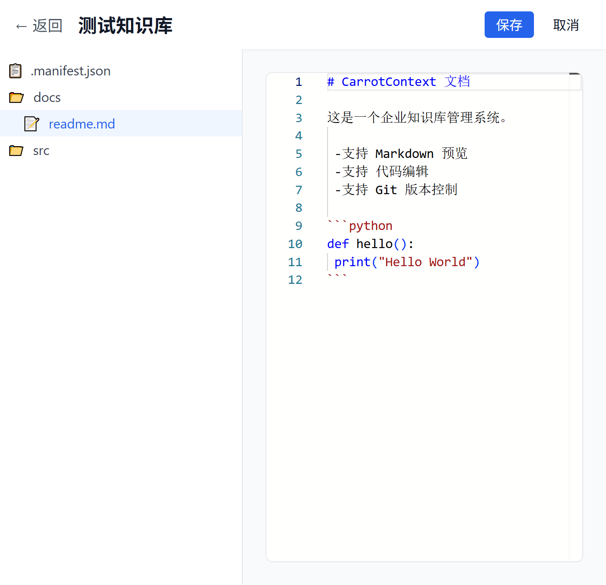
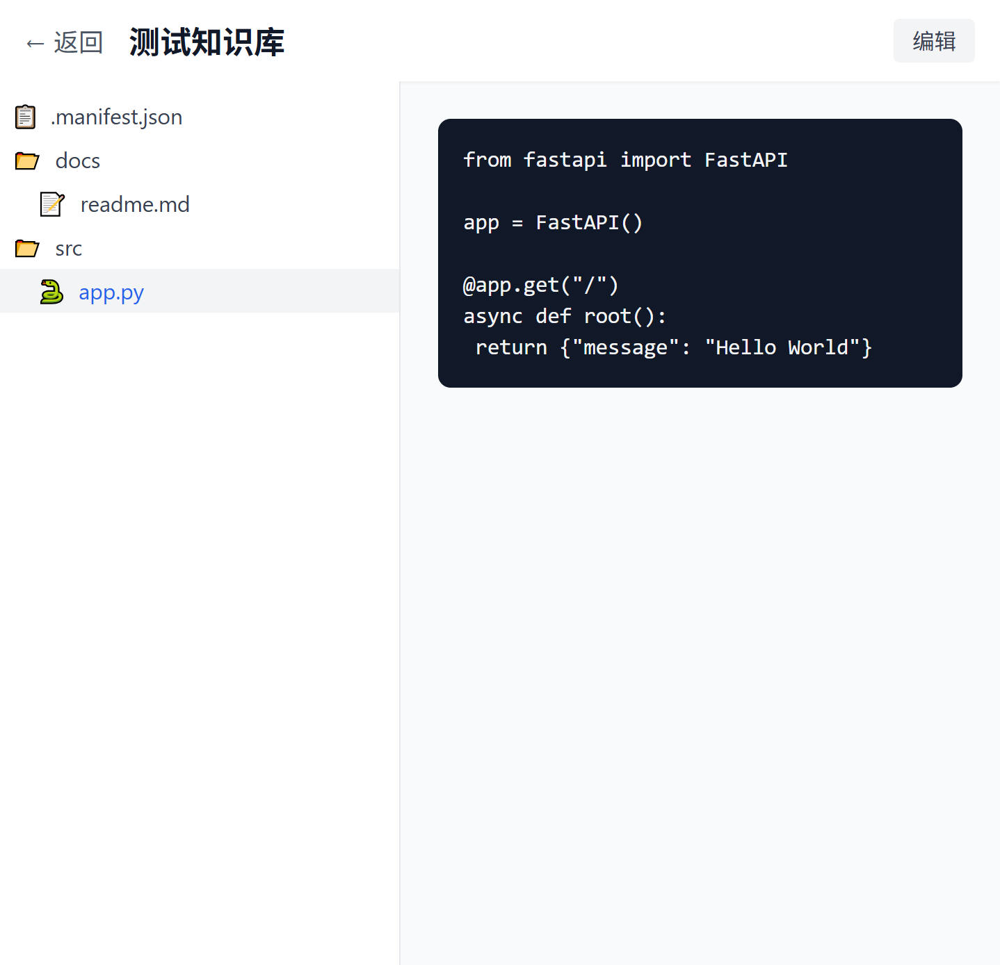

<div align="center">

# CarrotContext

一个基于文件系统的企业知识库管理系统

[](https://python.org)
[](https://fastapi.tiangolo.com)
[](https://reactjs.org)
[](LICENSE)

</div>

---

## ✨ 功能特性

| 功能 | 说明 |
|:---:|:---|
| 📚 | **知识库管理** - 创建、浏览、删除知识库 |
| 🌲 | **文件树浏览** - 支持文件夹展开/折叠的树形结构 |
| 📝 | **Markdown 预览** - 实时渲染，支持表格、代码高亮 |
| 💻 | **代码编辑器** - VSCode 风格的 Monaco Editor |
| 🔐 | **JWT 认证** - 安全的用户登录系统 |
| 🔒 | **文件锁定** - 悲观锁防止多人同时编辑冲突 |
| 🔄 | **Git 集成** - 版本控制、提交历史、差异对比 |
| 🔍 | **全文搜索** - BM25 元数据搜索 + ripgrep 内容搜索 |
| 🤖 | **MCP 服务** - Streamable HTTP 协议，支持外部 Agent 访问 |

## 📸 页面展示

### 登录页面

<div align="center">

</div>

### 主页面

<div align="center">

</div>

### 知识库详情

<div align="center">

</div>

### Markdown 预览

<div align="center">

</div>

### 代码编辑器

<div align="center">

</div>

### 代码预览

<div align="center">

</div>

## 🛠️ 技术栈

<div align="center">

**后端**


**前端**


</div>

## 🚀 快速开始

### 环境要求

- Python 3.11+
- Node.js 18+
- Bun (推荐) 或 npm

### 安装

```bash
# 克隆仓库
git clone https://github.com/your-username/CarrotContext.git
cd CarrotContext

# 后端
cd backend
uv sync

# 前端
cd ../frontend
bun install
```

### 启动

```bash
# 后端 (终端1)
cd backend
uv run uvicorn app.main:app --reload --host 0.0.0.0 --port 8000

# 前端 (终端2)
cd frontend
bun dev
```

访问 http://localhost:5173

### Docker

```bash
docker-compose up -d
```

## 📁 项目结构

```
CarrotContext/
├── backend/                    # Python 后端
│   ├── app/
│   │   ├── main.py            # FastAPI 入口
│   │   ├── auth/              # 认证模块
│   │   ├── knowledge/         # 知识管理
│   │   ├── lock/              # 文件锁定
│   │   ├── search/            # 搜索功能
│   │   ├── git/               # Git 集成
│   │   └── mcp/               # MCP 服务
│   └── tests/
├── frontend/                  # React 前端
│   ├── src/
│   │   ├── components/        # 组件
│   │   ├── pages/             # 页面
│   │   └── stores/            # 状态管理
│   └── tests/
├── docs/images/               # 文档图片
└── docker-compose.yml
```

## 📚 API 文档

启动后访问: http://localhost:8000/docs

| 方法 | 路径 | 说明 |
|:---:|:---|:---|
| POST | `/api/auth/register` | 用户注册 |
| POST | `/api/auth/login` | 用户登录 |
| GET | `/api/knowledge` | 获取知识库列表 |
| POST | `/api/knowledge` | 创建知识库 |
| GET | `/api/knowledge/{id}/tree` | 获取文件树 |
| GET | `/api/knowledge/{id}/file/{path}` | 获取文件内容 |
| PUT | `/api/knowledge/{id}/file/{path}` | 更新文件内容 |
| POST | `/api/search` | 搜索 |

## ⚙️ 配置

创建 `.env` 文件:

```env
DATABASE_URL=sqlite:///./data/carrotcontext.db
JWT_SECRET_KEY=your-secret-key
JWT_ALGORITHM=HS256
JWT_EXPIRE_MINUTES=30
VITE_API_URL=http://localhost:8000
```

## 📄 License

[Apache License 2.0](LICENSE)
